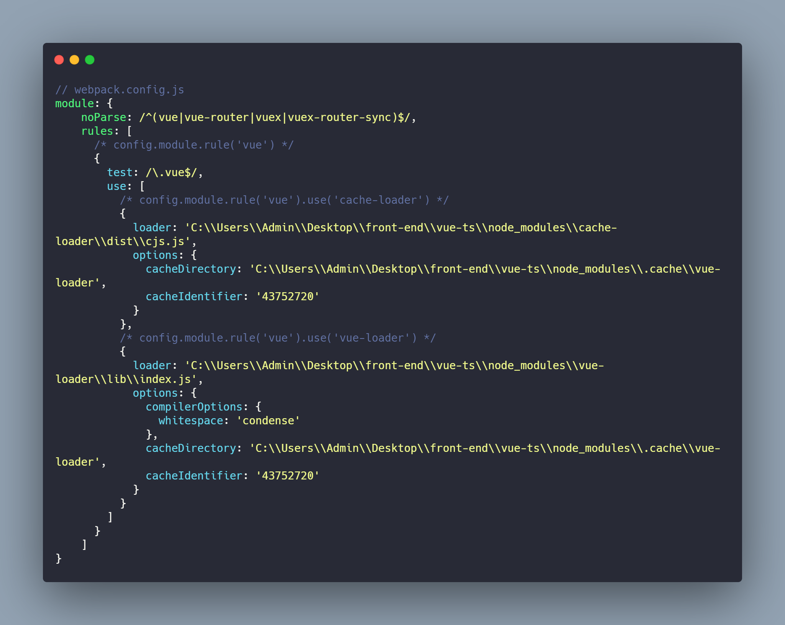
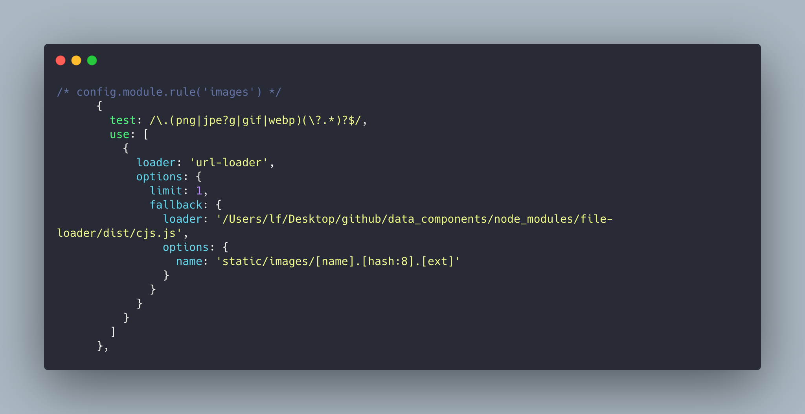
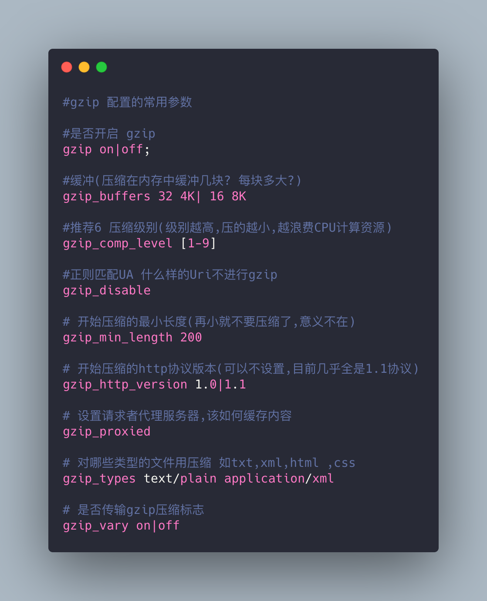

# 基于 Webpack4 的性能优化

> Webpack 性能优化参考例子 `vue-cli` 和 `data-components`，官方文档：https://www.webpackjs.com/。

## 编译优化

-   使用 `cache-loader` 缓存性能开销较大的 `loader`。

-   排除不需要编译的文件，或者只编译需要编译的文件。配置项 `noParse` `exclude` `include`。

    `noParse` 可以全局排除大型库。例如：`vue-cli` 排除了 Vue 全家桶相关的编译。`include` 只编译某些类型的文件，可以针对某个 `loader`。`exclude` 跟 `include` 相反。

-   `sourcemap` 优化

    `devtool`：`cheap-eval-source-map`。

    | 类型       | 说明                                                  |
    | ---------- | ----------------------------------------------------- |
    | eval       | 使用 `eval` 包裹模块代码                              |
    | source-map | 产生 `.map` 文件                                      |
    | cheap      | 不包含列信息，也不包含 `loader` 的 `sourcemap`        |
    | module     | 包含 `loader` 的 `sourcemap`                          |
    | inline     | 将 `.map` 作为 `DataURI` 嵌入，不单独生成 `.map` 文件 |

-   多进程编译

    -   `happypack`
    -   `thread-loader`

-   减少不必要的 `loader` 跟 `plugins`

## 打包优化

-   固定不变库的 `chunkhash`

    -   `webpack-manifest-plugin`、`dllPlugin` 和 `commonsChunkPlugin` 插件
    -   `splitChunks`：Webpack 配置

-   代码压缩混淆

    -   `UglifyJsPlugin` 插件

-   css 外链

    -   `ExtractTextPlugin` 插件

-   `runtime` 脚本内联

    -   `script-ext-html-webpack-plugin` 插件

-   资源引入优化

    -   `webpack-spritesmith`（image sprite）
    -   `svg-sprite-loader`（svg sprite）
    -   `url-loader`：将较小的资源使用 `DataURL` 引入，配合 `file-loader` 使用
        

-   `Gzip` 压缩

    -   `compression-webpack-plugin` 插件。启动 `GZip` 压缩，需要 `nginx` 配合
        

-   静态资源服务器

## 其他

-   查看资源打包体积

    -   `webpack-bundle-analyzer` 插件
    -   `vue ui` 命令

-   查看资源打包速度

    -   `speed-measure-webpack-plugin` 插件

-   压缩混淆优化

    -   `webpack-parallel-uglify-plugin` 插件

-   去除 vue 文件的空格

-   `preload` 与 `prefetch`

    -   `preload` 预加载。针对当前使用的资源进行提前请求，不需要等 `DOM` 解析 `link` 或者 `script` 标签再去请求
    -   `prefetch` 预加载。针对未来使用的资源进行提前请求

## 参考

-   [Webpack 中的 sourcemap](https://www.cnblogs.com/axl234/p/6500534.html)
-   [devtool 打包速度对比](https://webpack.docschina.org/configuration/devtool/#devtool)
-   [构建性能](https://webpack.docschina.org/guides/build-performance)
